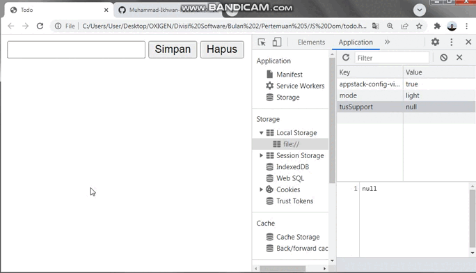

# Pertemuan 5

# Materi Mandiri

https://skilvul.com/courses/javascript-intermediate

# Materi Presentasi

https://docs.google.com/presentation/d/1SIhcF_4TYx6kStGMxoj_6hJ9N8bUfKMY/edit#slide=id.p1

# Materi Local Storage JavaScript

https://developer.mozilla.org/en-US/docs/Web/API/Window/localStorage

# Materi Array JavaScript

https://developer.mozilla.org/en-US/docs/Web/JavaScript/Reference/Global_Objects/Array

# Challenge
### Todo list dengan js dom, localStorage, dan array

File ada di folder JS DOM untuk referensi

<strong>Buatlah sistem login sederhana dengan js dom dan localStorage</strong>
<ul>
	<li></li>
</ul>